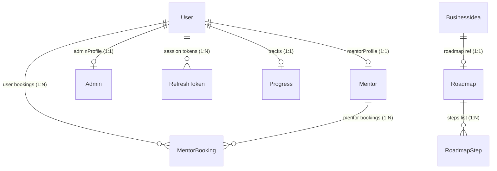

# EntreSkill Hub - Database Design & Strategy

This document outlines the database architecture, schema structures, relationships, index strategies, backup guidelines, and retention policies implemented for the MongoDB database using Mongoose ODM.

---

## 1. Entity Relationship & Collections

We utilize a hybrid schema design optimized for document-oriented databases. Document schemas combine references for cross-resource linkages (e.g., Bookings linking to Users) and nested subdocuments for bounded transactional context (e.g., Progress tracking steps and milestones).

### ER Diagram & Links


---

## 2. Collection Directory & Relationships

* **`users`**: Main user registry. Stores emails, password hashes, basic profile info, skills, and interests.
* **`mentors`**: Mentor-specific verification state, rating summaries, social links, rate per hour, and weekly calendar slots. Linked to `users` via `userId`.
* **`admins`**: Administrator registry. Linked to `users` via `userId`.
* **`refreshTokens` / `emailVerificationTokens` / `passwordResetTokens`**: Authorization state validation. Features TTL index options for automatic MongoDB background cleanup.
* **`businessIdeas`**: Main repository for business listings, expected ranges, requirements, expected difficulty, and mentor matches.
* **`roadmaps`**: Linked to `businessIdeas` mapping overview instructions.
* **`roadmapSteps`**: Bounded checklist items referenced by roadmaps.
* **`mentorBookings`**: Mapped slots matching users, mentors, dates, and times. Holds meeting notes and Jitsi meeting links.
* **`progress`**: Tracks completed roadmap steps, readiness scores, and issued certificates.

---

## 3. Database Index Strategy

To support high performance at scale, we configure indexes on all frequently-queried attributes:
1. **TTL Indexes**: `expiresAt` inside token collections automatically deletes expired tokens from the DB.
2. **Text Indexes**: `{ title: "text", description: "text", tags: "text" }` inside `businessIdeas` collection enables advanced search queries.
3. **Compound Indexes**: `{ mentorId: 1, bookingDate: 1, timeSlot: 1, status: 1 }` inside `mentorBookings` optimizes slot checks and prevents double bookings.
4. **Unique Constraints**: Unique fields like emails, slugs, and taxonomy values ensure data consistency at the DB layer.

---

## 4. Soft Delete, Retention, and Backup Strategies

### Soft Delete Strategy
* **Implementation**: Managed via a boolean flag `isDeleted` and Date field `deletedAt` on logical entities (`User`, `Mentor`, `BusinessIdea`, `Roadmap`, `MentorBooking`).
* **Queries**: Repositories automatically append `{ isDeleted: false }` to find queries, preventing deleted data from showing in client responses.

### Data Retention Policy
* **Tokens**: Automatically deleted using TTL indexes immediately upon expiration.
* **Audit Logs / System Health Records**: Archived to cold storage after 90 days.
* **Deactivated Accounts**: Maintained as `isActive: false` indefinitely or fully soft-deleted if requested by the user under GDRP compliance.

### Backup & Restore Strategy
* **Automated Backups**: Configured via MongoDB Atlas cloud backup policies.
  * Hourly snapshots retained for 2 days.
  * Daily snapshots retained for 7 days.
  * Weekly snapshots retained for 4 weeks.
* **Manual Backups**: Run using native command-line utility tools:
  ```bash
  # Backup
  mongodump --uri="mongodb+srv://<username>:<password>@cluster.mongodb.net/entreskill_hub" --out=/backups/daily/
  
  # Restore
  mongorestore --uri="mongodb+srv://<username>:<password>@cluster.mongodb.net/entreskill_hub" /backups/daily/
  ```
